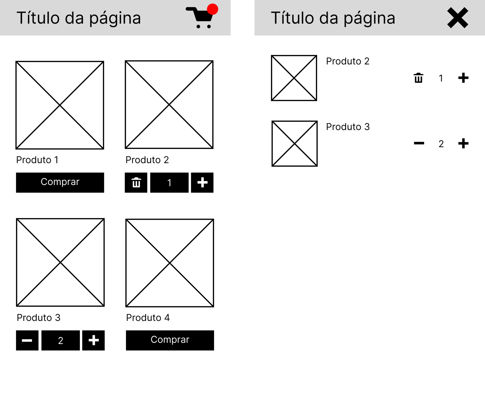
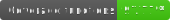
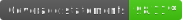

# App de Venda de Postcards

Este é um projeto inicial de um aplicativo de venda de postcards desenvolvido em React Native.

- O aplicativo possui três páginas: lista de produtos, detalhe do produto e carrinho de compras.
- Os produtos são baseados na API de obras de arte do [Art Institute of Chicago](https://api.artic.edu/docs/#introduction).

<div align="center"></div>
<p align="center">Wireframe base</p>
<div align="center"></div>
<p align="center">App printscreens</p>

## Como Rodar o Projeto

### 1. Instalar o projeto

Para instalar o projeto, você deve ter o [NodeJS](https://nodejs.org/en) na sua máquina. Após instalar o NodeJS, siga os seguintes passos:

```sh
$ git clone https://github.com/anaclara-gf/postcardshopping.git

$ cd ./postacardshopping

$ npm install
```

### 2. Iniciar o projeto

Fazer o download e instalar o [Android Studio](https://developer.android.com/studio) e instalar o [JDK11](https://www.oracle.com/br/java/technologies/javase/jdk11-archive-downloads.html). Para maior detalhes, seguir [esse passo a passo do React Native](https://reactnative.dev/docs/environment-setup).

Abra um emulador Android no seu computador e siga os seguintes comandos:

```sh
$ npx react-native start

$ npx react-native run-android
```

## Dependências Externas

As seguintes dependências externas foram utilizadas no projeto:

[React Navigation](https://reactnavigation.org/) - para organizar a navegação entre telas.

[React Native Elements](https://reactnativeelements.com/) - para o componente de Overlay e Dialog.

[React Native Vector Icons](https://www.npmjs.com/package/react-native-vector-icons) - para exibição de ícones.

[Axios](https://axios-http.com/ptbr/docs/intro) - para requisições http.

[Redux](https://redux.js.org/) - para armazenamento de estado na aplicação.

Foi utilizado o Redux em vez da Context API para permitir uma maior escalabilidade no futuro e porque o estado armazenado (lista de produtos selecionados) deve mudar de forma dinâmica e rápida.

## Testes






Foram feitos testes de componentes com Jest (configurado junto com a inicialização do projeto) e [Testing Library](https://testing-library.com/). Para executar os testes, basta executar o comando `npm test`.

## Considerações Finais

O projeto foi iniciado com React Native CLI para que no futuro seja mais fácil integrar módulos nativos Android e iOS. O objetivo é fornecer uma base sólida e escalável para um aplicativo de venda de postcards que pode ser facilmente modificado e expandido.

<p align="center">App preview</p>
<div align="center"></div>
